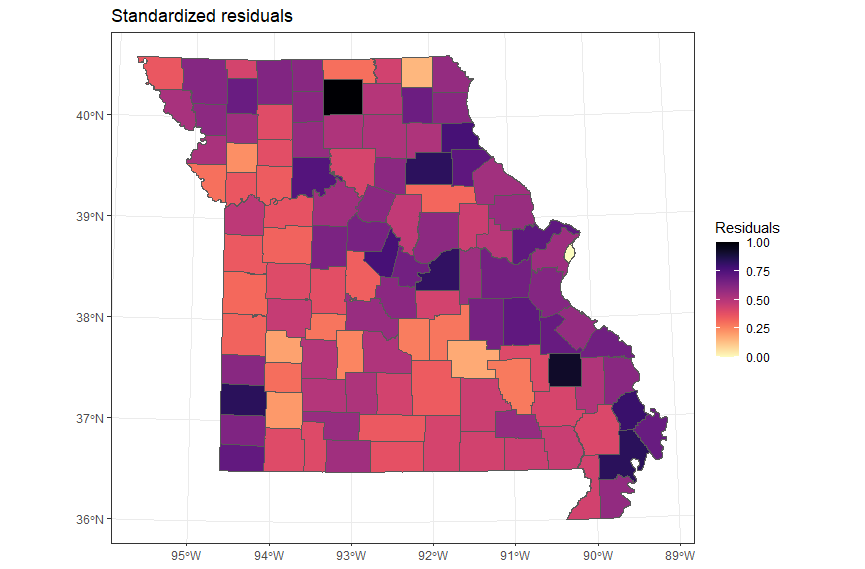

# Estimating County Level Covid-19 Data in the State of Missouri using Spatial Area Regression

- Modeled the positive COVID-19 rate as a function of test rate, vaccination rate, population, and more.
- Evaluated spatial dependence in the residuals using Moran's I statistic.
- Implemented a **Conditional Autoregressive Model** achieving an AIC value of 948.38.

